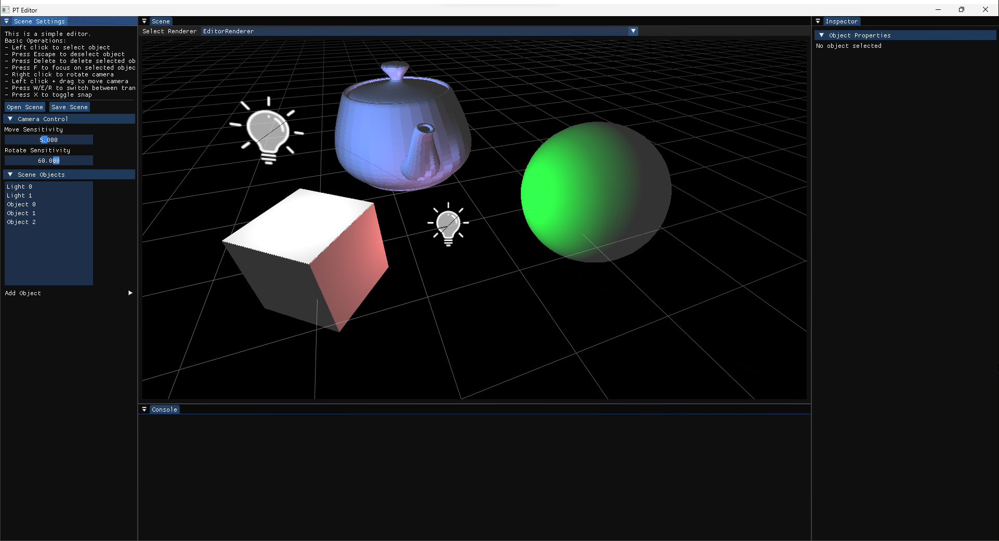
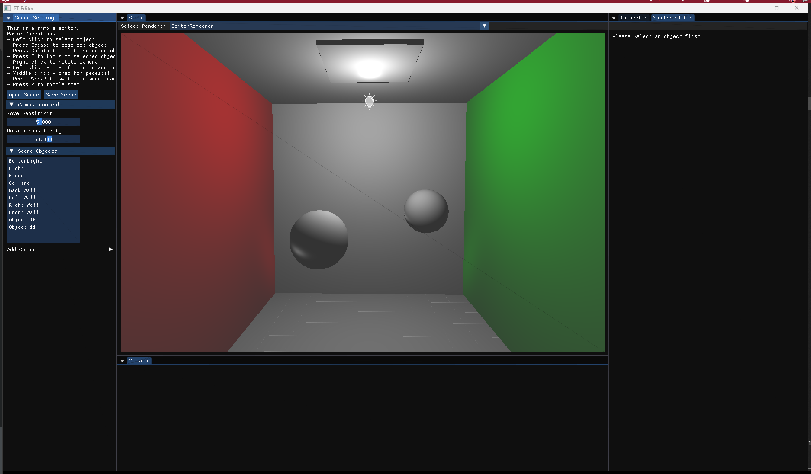
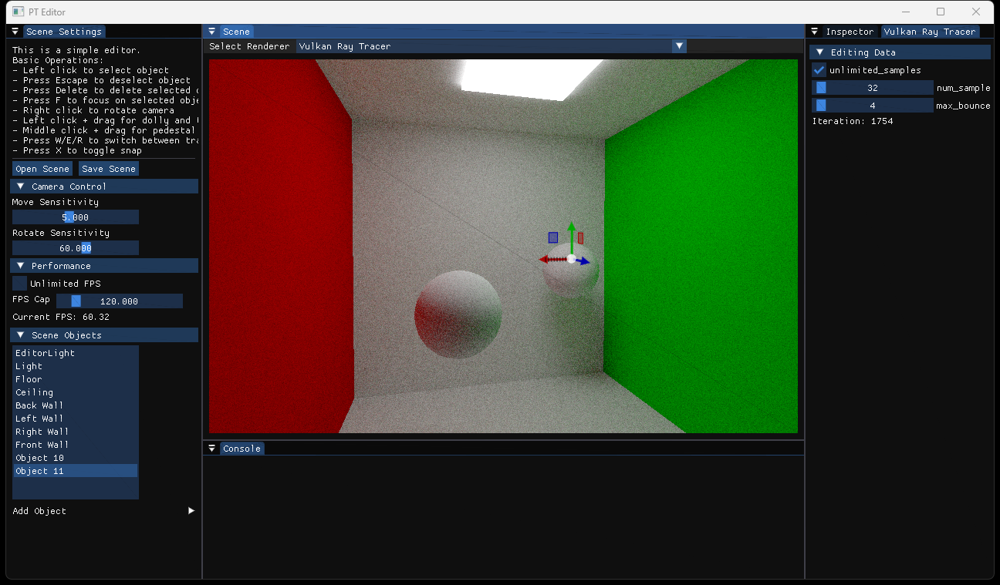

# PTStudio: Simple 3D scene editor and renderer written in C++17
PTStudio is a light-weight, modular, and extensible 3D scene editor and renderer written in C++17. It is my personal hobby project to learn modern C++, OpenGL, CUDA, Vulkan, and other graphics-related technologies. It is also a playground for me to experiment with new ideas and techniques.

## Disclaimer
This project is still in its early stage and might be quite buggy. I am still **actively** working on the basic functionalities. See the section below for the current roadmap and feature overview of this project. As the project matures, I will add more documentation, examples, demos, and tests. The source code structure is still undergoing major changes, so I may not be able to accept pull requests at this time. However, I am always open to suggestions and minor fixes. Please feel free to open an issue if you have any questions or suggestions.

## Screenshots and Demos
https://github.com/dw218192/PTStudio/assets/31294154/4116308d-ee31-4d20-a449-f130d11fe253






## Build Instructions

### Prerequisites
- CMake 3.19
- C++17 compiler
- CUDA, Vulkan, OpenGL

### Dependencies
- make sure to recursively clone the submodules using
```bash
git clone --recursive [repo url]
```

## Roadmap (As of 2023/11/26)
- High Priority
    - [x] implement renderer switcher
    - [x] implement performance display
        - [x] fix FPS display bug
    - [ ] implement child object
        - [ ] a child object's transform is updated when its parent's transform is updated
    - [ ] Editing Improvements
        - [ ] put mesh loading in a separate thread
        - [ ] adaptive grid resizing
        - [ ] Ctrl+S to save scene (first time a file dialog will pop up, then subsequent saves will save to the same file)
        - [ ] Ctrl+D and Ctrl+C to duplicate selected objects
        - [ ] Ctrl+Z and Ctrl+Y to undo/redo
        - [ ] camera should move faster the further away it is from the center
    - [ ] emissive material should be considered as a light source in editor renderer
    - [ ] lights should be considered in vulkan ray tracer
    - [ ] fix sphere primitive uv bug
    - [ ] reflection system improvements
        - [x] support for single inheritance
        - [ ] support for reference and pointer members
- Medium Priority
    - [ ] implement undo/redo system
    - [ ] fix GLTexture::save() bug
    - [ ] fix potential bugs in GL wrapper classes (usage of std::swap in move might swap in uninitialized data)
    - [x] log flush timer
    - [ ] add the ability to append custom data to scene objects
        - [ ] possible strategy: a component system, we can attach a component to a scene object
        - [ ] problem: how to handle dynamically registered component types? 
            - requirement for component class:
                - no inheritance (our reflection system doesn't support inheritance)
                - must be serializable (i.e. must have a default constructor)
                - must be reflectable
                - can be constructed given its class name
- Low Priority
    - [ ] implement scene object hierarchy
    - [ ] implement asset system
    - [ ] implement dynamic renderer DLL loading & unloading
