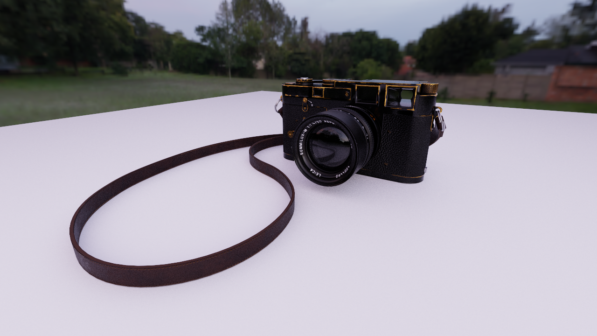
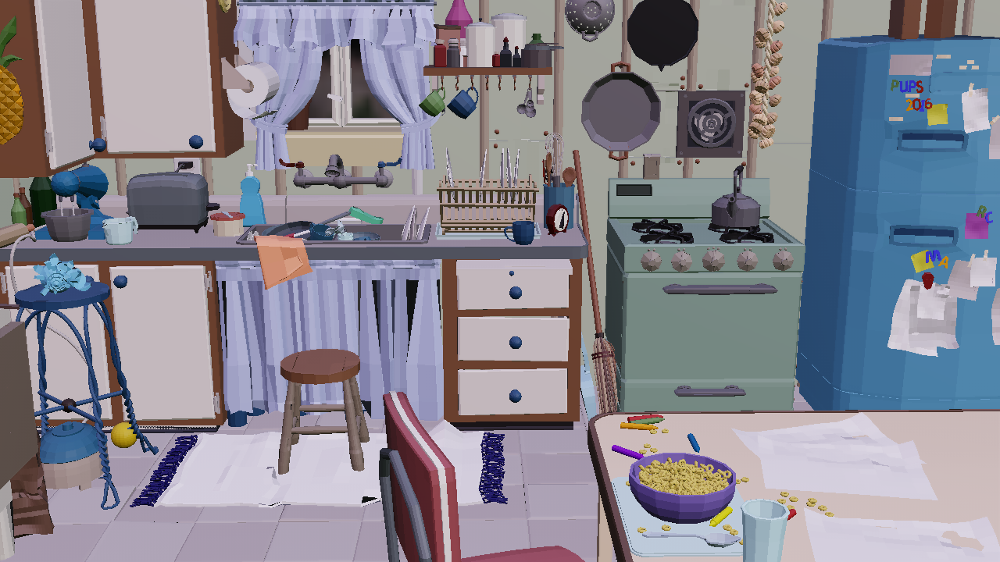
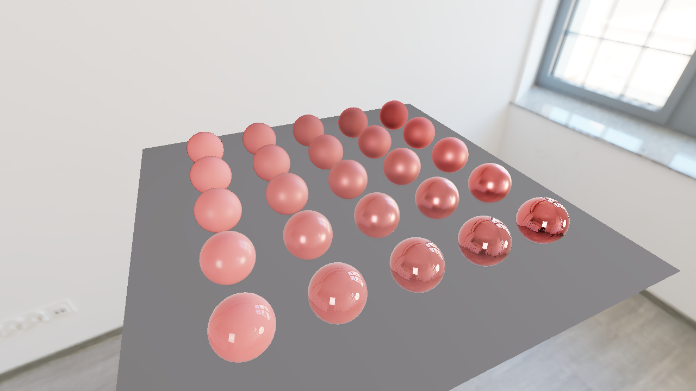
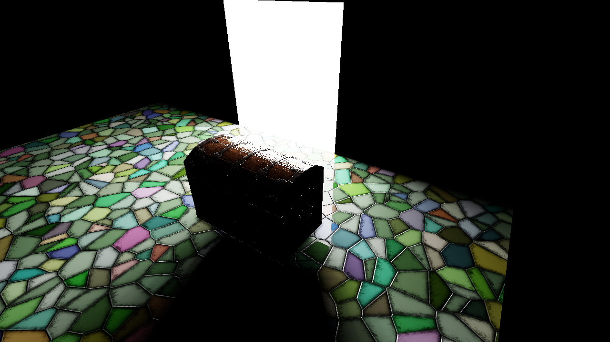
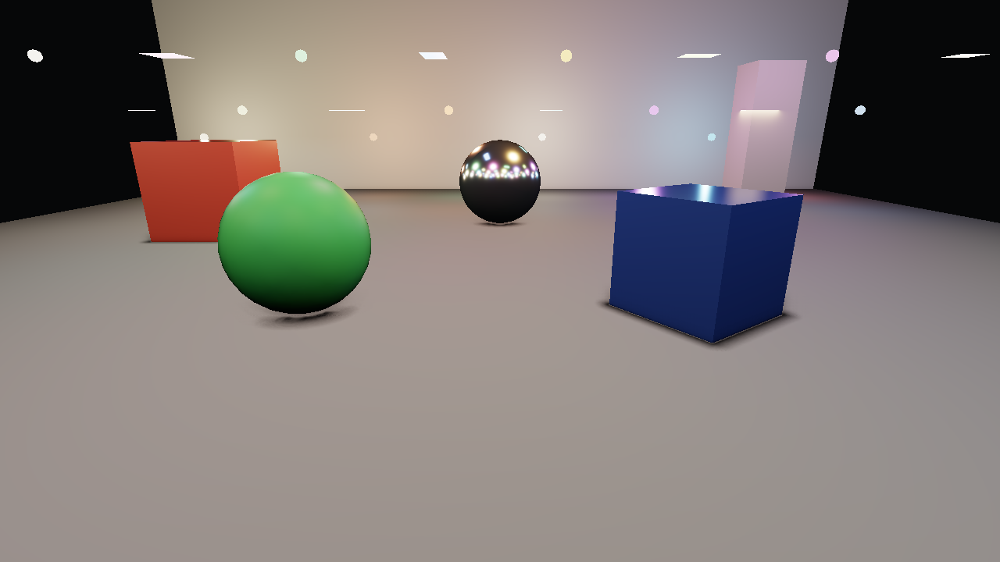

# PTStudio

A real-time and offline renderer built on **WebGPU** and **OpenUSD**, written in C++17. One codebase, one shader source, two targets: a native desktop app (Dawn) and a browser build (Emscripten + emdawnwebgpu).

It started as a hobby project to learn modern graphics, and turned into a playground for implementing rendering techniques end to end -- from the shader math up through the frame graph, the asset pipeline, and the regression harness that keeps them honest.

**[Try it in your browser](https://dw218192.github.io/PTStudio/editor/)** -- no install, runs on WebGPU.

> Requires a WebGPU-capable browser -- a recent Chrome or Edge is the safest bet.

---

## Gallery



*Progressive path tracer. Physically-based materials, IBL from an HDR environment, and a BVH-accelerated compute traversal.*



*Pixar's Kitchen Set (1788 prims) loaded straight from USD and rendered in real time -- geometry, texture binding, and material resolution all driven by the USD stage.*

<table>
<tr>
<td width="50%"></td>
<td width="50%"></td>
</tr>
<tr>
<td><em>Roughness/metallic sweep under image-based lighting -- split-sum specular with a prefiltered environment and BRDF LUT.</em></td>
<td><em>LTC area light with PCSS soft shadows. Penumbra width tracks the emitter's size, and the visibility signal is temporally resolved with variance clamping.</em></td>
</tr>
<tr>
<td colspan="2"></td>
</tr>
<tr>
<td colspan="2"><em>Many-light scene exercising the forward light iteration path, which currently loops over every light in the scene. Clustered light assignment is the next step here.</em></td>
</tr>
</table>

---

## Two renderers, one scene representation

PTStudio ships two interchangeable renderers over a shared USD-backed scene. You can flip between them at runtime on the same stage, which makes the rasterizer directly comparable against a ground-truth reference.

| | |
|---|---|
| **Forward** | Forward renderer with a G-buffer prepass, analytic area lights, shadow maps, screen-space effects, and IBL. This is the real-time path. |
| **Path Trace** | Progressive BVH path tracer running as a compute pass. Same materials, same lights, same stage -- used both as a visual target and as the source of truth for the automated image-diff suite. |

## Techniques implemented

### Lighting and materials

- **LTC area lights** -- linearly transformed cosines for rect and disk lights, giving analytic, noise-free specular and diffuse response from area sources rather than punctual approximations.
- **Cook-Torrance PBR** with a GGX/Smith BRDF, metallic-roughness workflow, normal mapping, and USD `UsdPreviewSurface` material binding.
- **Image-based lighting** -- equirectangular-to-cubemap projection, irradiance convolution for the diffuse term, roughness-prefiltered specular mips, and a precomputed split-sum BRDF LUT.
- **Glass and transmission** -- refractive materials shared between the raster and path-traced paths.

### Shadows

This is where most of the work went.

- **PCSS soft shadows** -- percentage-closer soft shadows with blocker search, for distant (directional) lights as well as rect and disk area lights, so penumbra width tracks the actual emitter size.
- **Receiver-plane depth bias** -- derivative-based bias propagated through the light's clip space, which is what makes PCSS survive grazing angles without acne or peter-panning.
- **Split visibility pipeline** -- shadow visibility is generated and resolved in separate passes rather than sampled inline, decoupling shadow cost from shading and making the visibility signal available to temporal filtering.
- **Temporal resolve with variance clamping** -- history is reprojected using G-buffer motion vectors and clamped against the local neighborhood's variance, which suppresses the noise of a sparse PCSS kernel without smearing on motion.
- **Contact shadows** -- screen-space ray marching to recover the short-range occlusion that shadow-map resolution drops.

### Screen space and post

- **SSAO** with a bilateral (depth-aware) blur.
- **G-buffer motion vectors** driving history reprojection.
- **Tone mapping** as the final graph node.

### Architecture

- **Frame graph** -- passes declare their textures, buffers, and descriptor sets up front through a builder, and the graph compiles those declarations into concrete GPU resources. Everything is referenced by strong-typedef integer handles with implicit liveness; names exist only as debug labels.
- **Shader-driven descriptors** -- bind group layouts are generated from Slang reflection data rather than hand-written and kept in sync by hope.
- **Async scene preparation** -- USD stage traversal and CPU-side data prep run off the render thread, feeding an immutable `PreparedSceneData` snapshot to the renderer.

## Pipeline in one paragraph

Shaders are authored once in **Slang** and compiled to WGSL at build time. Scenes are **OpenUSD** stages, packaged to USDZ at build time and embedded into the web build -- the full USD runtime, TBB included, is static-linked into WASM. Correctness is checked mechanically: golden images baked with the path tracer at 4096 spp, diffed against the forward renderer with a perceptual **FLIP** metric, plus headless PNG capture so every rendering change is verified against a picture rather than a green build.

## Build

```bash
bash tools/framework/bootstrap.sh   # one-time: sets up the hermetic tool environment
./repo build
./repo test
```

## Documentation

- [Building](docs/building.md) -- prerequisites, web builds, Conan and tooling
- [Pipeline and verification](docs/pipeline.md) -- Slang/WGSL, USD assets, image-diff, headless capture
- [Known issues](docs/known-issues.md) -- open gaps and limitations, with evidence

## Status and known gaps

This is a hobby project, and it has rough edges worth naming rather than hiding. The largest: the Forward renderer drops the D3D12 device on GPU-less software adapters (pre-existing, so CI runs the path-tracer smoke tests instead), and the image-diff suite currently exceeds its thresholds against path-traced ground truth. Clustered lighting is not implemented -- the forward path loops over every light. All of it, with the measurements behind each claim, is in [docs/known-issues.md](docs/known-issues.md).
