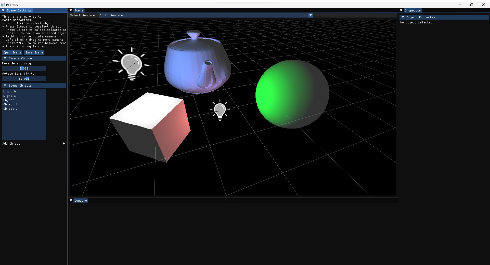
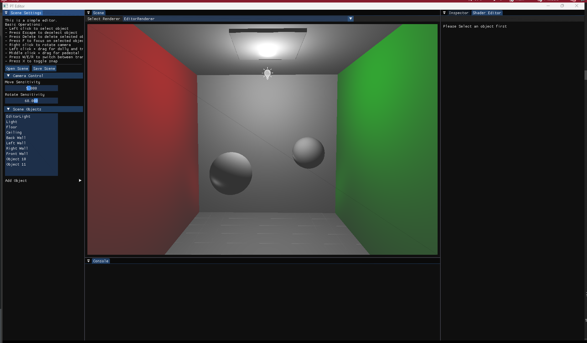
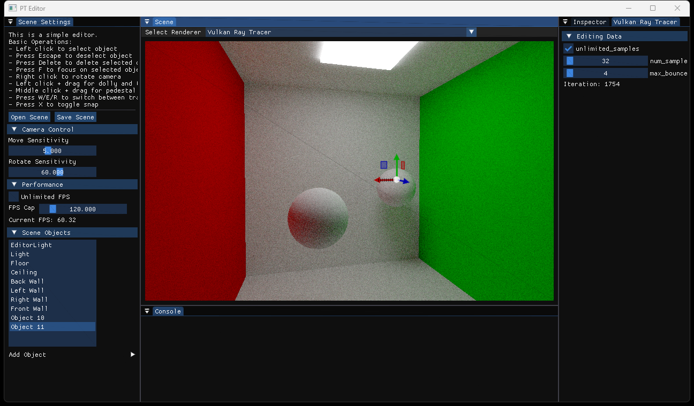

# PTStudio: Simple 3D scene editor and renderer written in C++17
PTStudio is a light-weight, modular, and extensible 3D scene editor and renderer written in C++17. It is my personal hobby project to learn modern C++, OpenUSD, WebGPU, and other graphics-related technologies. It is also a playground for me to experiment with new ideas and techniques.

## Screenshots and Demos
https://github.com/dw218192/PTStudio/assets/31294154/4116308d-ee31-4d20-a449-f130d11fe253

## Repository Tooling
- This project uses a hermetic tooling initialization process where all the tools are pulled in as Python packages, and python is used to perform various tasks like building, formatting, etc.
- To see the available tool commands, run `pts.cmd --help` (Windows) or `./pts --help` (bash/Unix).

## Build & Test Instructions
- Run the repository tooling entrypoint to build the project:
  - Windows: `pts.cmd build`
  - Bash/Unix: `./pts build`
- Run tests:
  - Windows: `pts.cmd test`
  - Bash/Unix: `./pts test`

### Prerequisites
- C++ Compiler Toolchain (GCC, Clang, MSVC, etc.)
- GPU driver with Vulkan/OpenGL support

### Dependencies and Reproducible Build
- Conan is the package manager used to pull or package dependencies (see `conanfile.py` for the list of dependencies)
- Depending on whether a package is available in conan center, it will be pulled from there or packaged locally (`./tools/conan`)